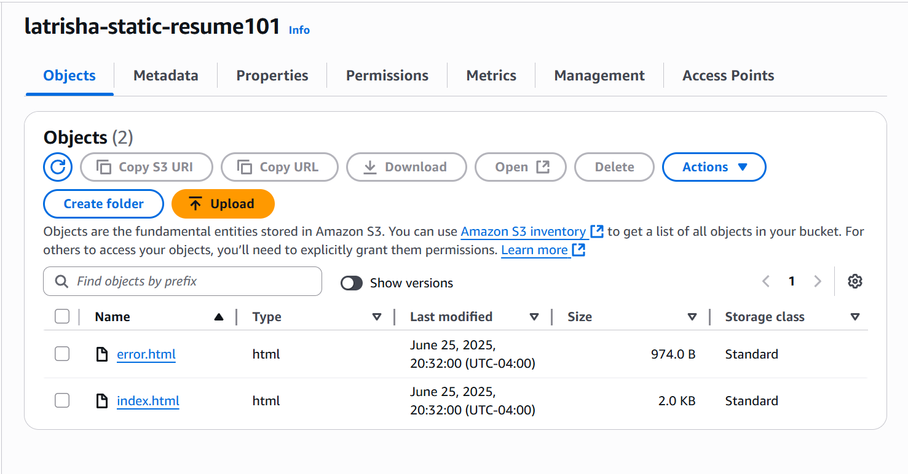
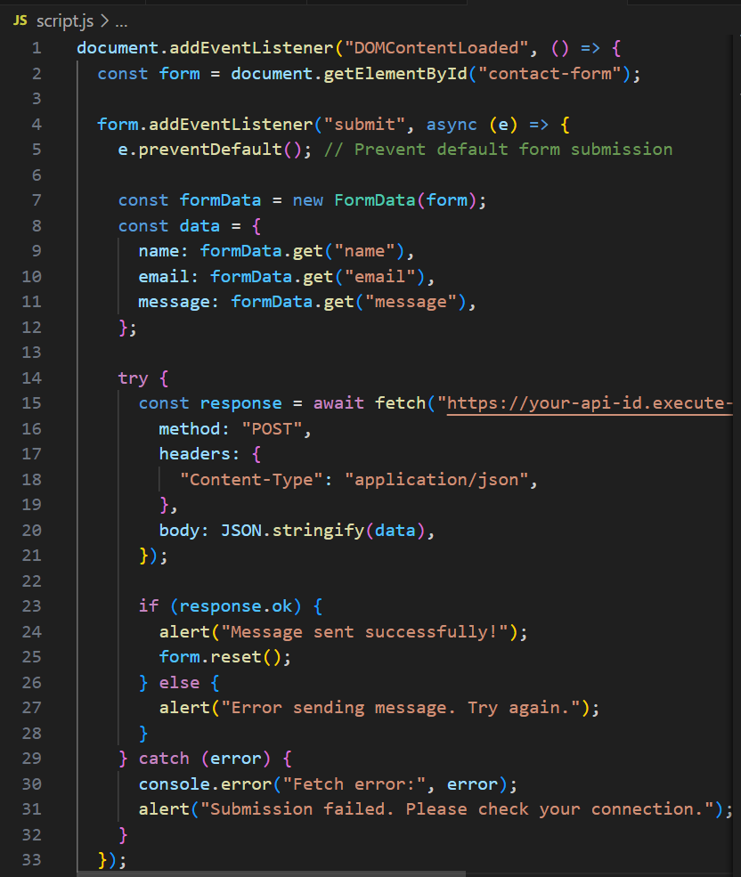
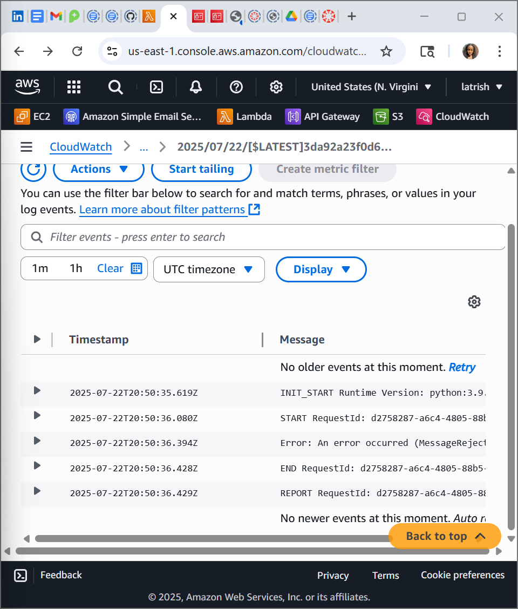
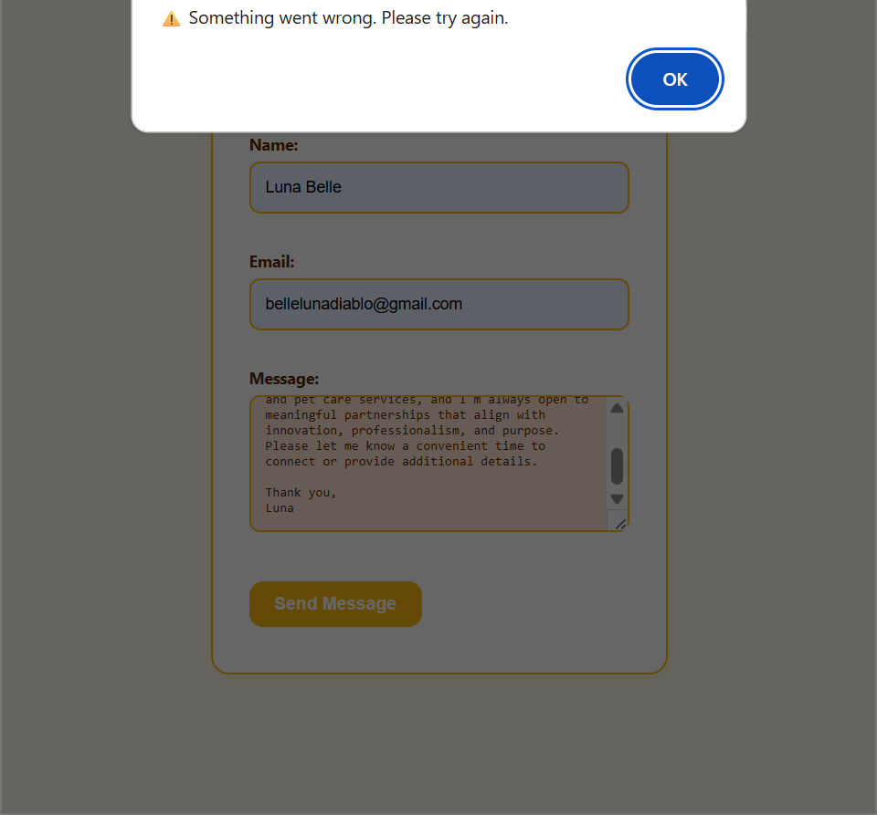
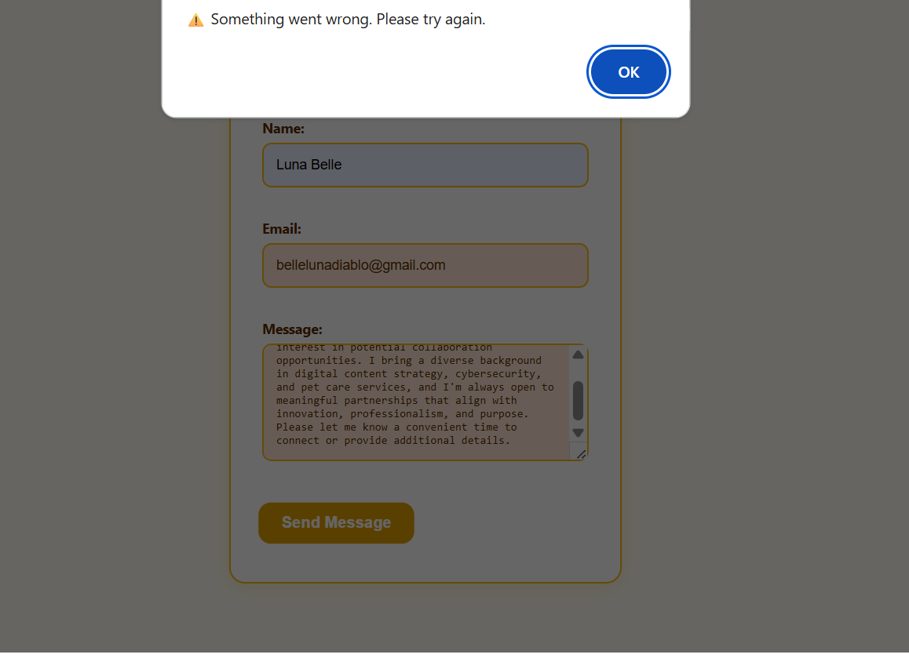
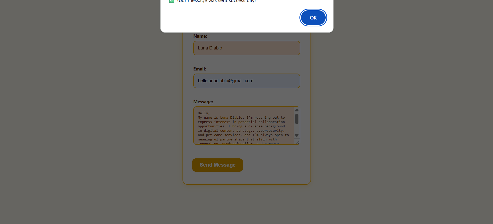

# Serverless Contact Form with AWS

This project documents the setup, testing, and deployment of a **serverless contact form** integrated into a static portfolio website hosted on Amazon S3. It uses **HTML, CSS, JavaScript**, and AWS services including **Lambda, API Gateway, and Simple Email Service (SES)**.

---

## 📌 Project Overview

The goal was to create a secure, serverless contact form that emails form submissions directly to my inbox using AWS infrastructure—without relying on third-party services.

---

## 🛠️ Tools & Technologies

- **Frontend:** HTML, CSS, JavaScript
- **Backend:** AWS Lambda (Node.js)
- **API Gateway**: Handles HTTP requests
- **SES (Simple Email Service)**: Sends emails
- **S3 Bucket**: Hosts the static site
- **CloudWatch**: Debugging and error monitoring

---

## ✅ Functional Workflow

1. User fills out the form (Name, Email, Message).
2. JavaScript sends a `POST` request to the API Gateway endpoint.
3. API Gateway triggers a Lambda function.
4. Lambda validates and sends the message to my email using SES.
5. User receives a confirmation or error alert on the site.

---

## 🔧 Setup & Configuration

### 1. **S3 Bucket Setup**
- Created bucket: `latrisha-portfolio-site`
- Enabled static website hosting.
- Uploaded `index.html` and `script.js`.

📸 *S3 bucket showing site files:*  


---

### 2. **Lambda Function**
- Wrote logic to parse form data and send email via SES.
- Configured IAM permissions for SES access.

📸 *Lambda JavaScript form logic:*  


---

### 3. **API Gateway**
- Created REST API
- Linked POST method to Lambda
- Enabled CORS for site access

📸 *CloudWatch showing SES error:*  


---

## ⚠️ Common Errors & Fixes

### ❌ SES MessageRejected Error
- **Cause:** Email not verified (SES sandbox)
- **Fix:** Verified sender/receiver emails in SES console

📸 *SES Rejection Error:*  


---

### ❌ JavaScript Fetch Error
- **Cause:** Incorrect endpoint or CORS issue
- **Fix:** Replaced dummy endpoint with valid API Gateway URL

📸 *Frontend error message:*  


---

### ✅ Success Confirmation
Once SES and endpoint were corrected, form submissions succeeded.

📸 *Success popup from form:*  


---

## 📄 JavaScript Snippet (Frontend)

```javascript
form.addEventListener("submit", async (e) => {
  e.preventDefault();
  const formData = new FormData(form);
  const data = {
    name: formData.get("name"),
    email: formData.get("email"),
    message: formData.get("message"),
  };

  try {
    const response = await fetch("https://your-api-id.execute-api.us-east-1.amazonaws.com/prod/contact", {
      method: "POST",
      headers: { "Content-Type": "application/json" },
      body: JSON.stringify(data),
    });

    if (response.ok) {
      alert("Message sent successfully!");
      form.reset();
    } else {
      alert("Error sending message. Try again.");
    }
  } catch (error) {
    alert("Submission failed. Please check your connection.");
  }
});
🧩 GitHub Documentation Steps
1. Repo Initialization
📸 Git init and README:

2. Commit Errors
📸 Git fatal pathspec error:

3. Add & Commit Fix
📸 Commit screenshot:

🚀 Live Portfolio
https://latrisha-portfolio-site.s3-website-us-east-1.amazonaws.com

🔮 Future Enhancements
Integrate CAPTCHA to reduce spam

Move SES out of sandbox

Add form validation + backend sanitization

🔥 Credits
Thanks to The Knowledge House for guidance during this fellowship project.
